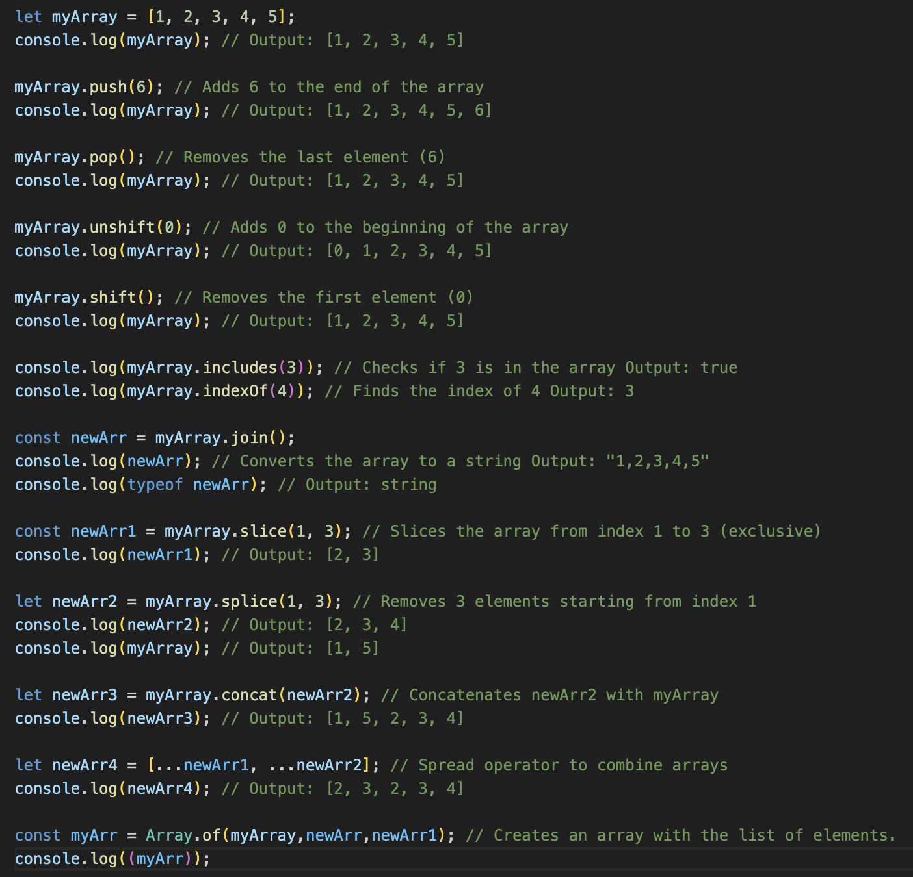
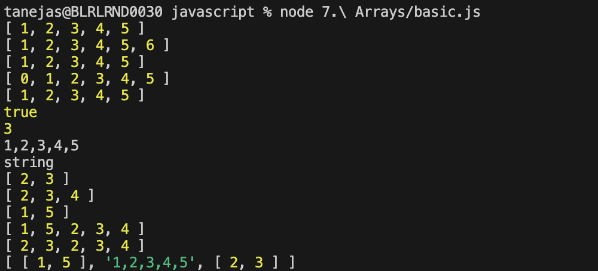

## Arrays in JavaScript

Arrays are objects used to store multiple values in a single variable. They are resizable, zero-indexed, and can hold elements of different types.

### Key Concepts

- **Resizable:** Arrays can grow or shrink in size.
- **Zero-indexed:** The first element is at index 0.
- **Shallow Copy:** Copying an array creates a new reference, but nested objects are still shared.

### Common Array Methods

- **push()**: Add an element to the end
- **pop()**: Remove the last element
- **unshift()**: Add an element to the start
- **shift()**: Remove the first element
- **includes()**: Check if a value exists
- **indexOf()**: Get the index of a value
- **join()**: Combine elements into a string
- **concat()**: Merge arrays
- **spread (`...`)**: Expand array elements
- **flat()**: Flatten nested arrays
- **Array.of()**: Create a new array from arguments

### Examples

```js
let arr = [1, 2, 3];
arr.push(4); // [1,2,3,4]
console.log(arr.includes(2)); // true
let flatArr = [1, [2, 3]].flat(); // [1,2,3]
```


