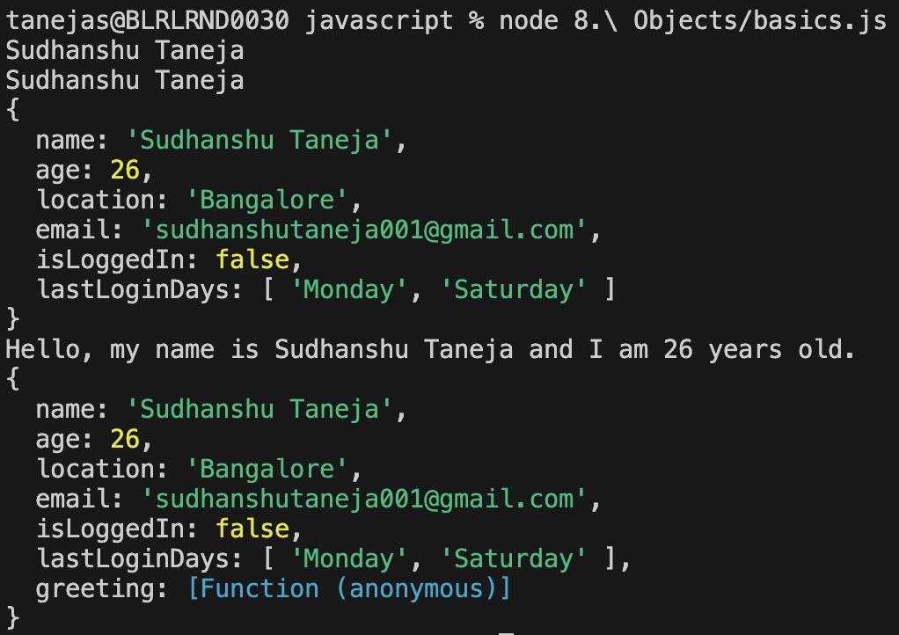

## Objects in JavaScript

Objects are collections of key-value pairs used to store and organize data. They can be created using literals or constructors.

### Key Concepts

- **Object Literals:**
	- Multiple instances can be created.
	- Syntax: `{ key: value }`

```js
const person = { name: "Alice", age: 30 };
```




- **Object Constructors:**
	- Used to create singleton or multiple objects using functions.

```js
function Car(model) {
	this.model = model;
}
const myCar = new Car("Toyota");
```


### Object Destructuring

Destructuring allows extracting values from objects into variables:

```js
const user = { id: 1, username: "bob" };
const { id, username } = user;
```


