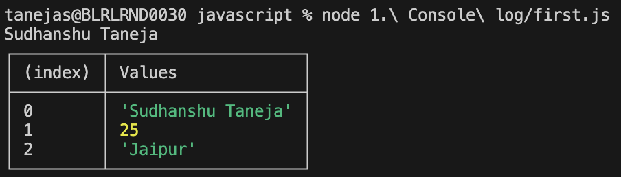

## Console Output in JavaScript

JavaScript provides several methods to display output and debug information in the browser or Node.js console. The most common are `console.log` and `console.table`.

### Key Concepts

- **console.log()**: Prints messages or variable values to the console. Useful for debugging and tracking the flow of code.
- **console.table()**: Displays tabular data (like arrays or objects) in a table format, making it easier to read complex structures.

### Examples

```js
// Using console.log to print a string and a variable
let name = "Alice";
console.log("Hello, " + name); // Output: Hello, Alice

// Using console.table to print an array of objects
const users = [
	{ id: 1, name: "Alice" },
	{ id: 2, name: "Bob" }
];
console.table(users);
```

### Visual Output

Below is an example of how output appears in the console:



---
Use these methods to make debugging and data inspection easier while developing JavaScript applications.