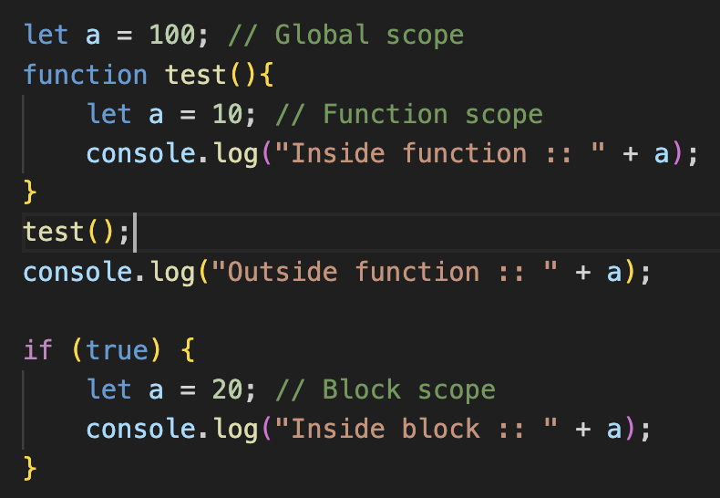
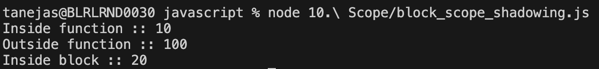

# Global & Local scope

Global scope - Variables and functions declared in the global scope are accessible from anywhere in the entire JavaScript program.

Local scope - Local scope refers to the accessibility of variables and functions within a specific, confined part of the code like functions, if-else block, for loop etc.

