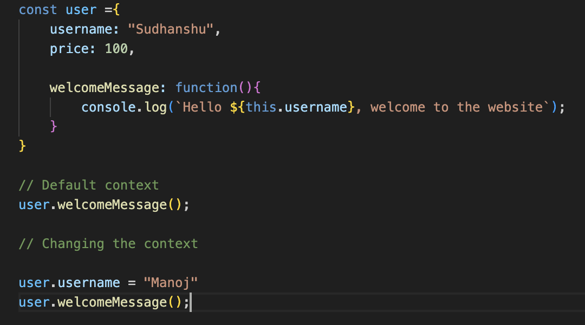
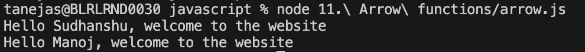
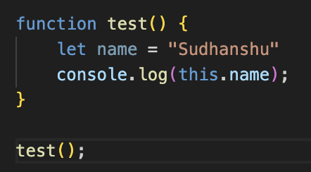
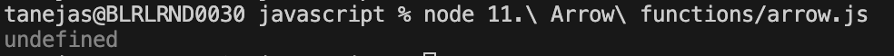
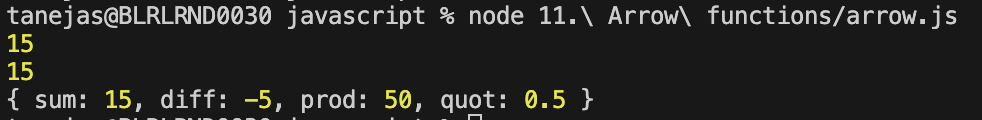

# This keyword

This keyword is javascript refers to the context in which a function is executed. It's value is determined at runtime, based on how the function is called, rather than where it is defined.

In the node or default environment, this refers to an empty object. In the browser, this refers to the window object.

This keyword can't be used normally in a function.

# Arrow function

Arrow function provides a concise syntax for writing function expressions in javascript.

