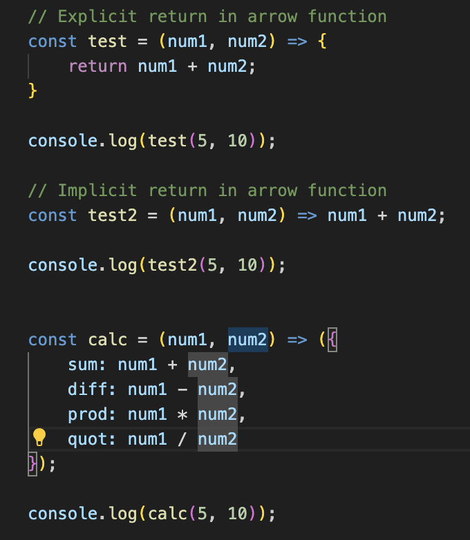

## Arrow Functions and `this` Keyword in JavaScript

Arrow functions provide a concise syntax for writing function expressions. The value of `this` inside an arrow function is inherited from the enclosing scope.

### Key Concepts

- **Arrow Functions:**
	- Shorter syntax: `const fn = () => { ... }`
	- Do not have their own `this`, `arguments`, or `super`.
- **`this` Keyword:**
	- Refers to the context in which a function is executed.
	- In arrow functions, `this` is lexically scoped (inherits from parent).
	- In regular functions, `this` depends on how the function is called.

### Examples

```js
const obj = {
	value: 42,
	regular: function() { return this.value; },
	arrow: () => this.value
};
console.log(obj.regular()); // 42
console.log(obj.arrow());   // undefined (or window/global in browser)
```


// Arrow function example
```js
const add = (a, b) => a + b;
```


