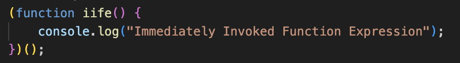
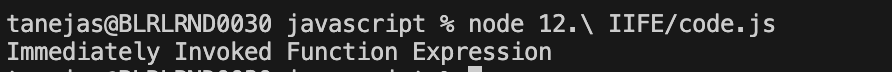

## IIFE (Immediately Invoked Function Expression) in JavaScript

An IIFE is a function that runs as soon as it is defined. It helps create a private scope and avoid polluting the global namespace.

### Key Concepts

- **Syntax:**
	- The function is wrapped in parentheses and immediately invoked: `(function(){ ... })();`
- **Use Cases:**
	- Execute code immediately
	- Create private variables
	- Avoid global scope pollution

### Example

```js
(function() {
	let privateVar = "hidden";
	console.log("IIFE runs immediately!");
})();
```

### Visuals


