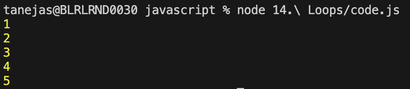
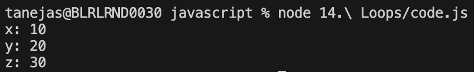
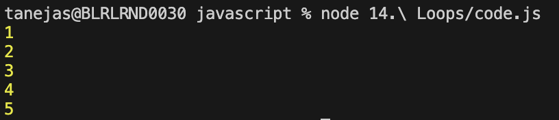

## Loops in JavaScript

Loops are fundamental programming constructs that allow you to execute a block of code multiple times, making it easier to handle repetitive tasks efficiently. In JavaScript, loops help automate and simplify operations on arrays, objects, and other data structures.

### Common Types of Loops

- **for loop**: Used when the number of iterations is known. It consists of an initialization, a condition, and an increment/decrement statement.
	```js
	for (let i = 0; i < 10; i++) {
		console.log(i);
	}
	```
    

- **while loop**: Executes a block of code as long as a specified condition is true. Useful when the number of iterations is not known in advance.
	```js
	let i = 0;
	while (i < 5) {
		console.log(i);
		i++;
	}
	```
    

- **do...while loop**: Similar to the while loop, but guarantees that the code block runs at least once before checking the condition.
	```js
	let i = 0;
	do {
		console.log(i);
		i++;
	} while (i < 5);
	```
    

- **for...of loop**: Iterates over iterable objects like arrays, strings, etc.
	```js
	for (const value of [1, 2, 3, 4, 5]) {
		console.log(value);
	}
	```
	

- **for...in loop**: Iterates over the enumerable properties of an object.
	```js
	const obj = { x: 10, y: 20, z: 30 };
	for (const key in obj) {
		if (obj.hasOwnProperty(key)) {
			console.log(`${key}: ${obj[key]}`);
		}
	}
	```
	


- **for...each loop**: Iterates over the enumerable values of an array.
	```js
	const numbers = [1, 2, 3, 4, 5];
	numbers.forEach((number) => {
		console.log(number);
	});
	```
	

Each loop type serves different use cases, and understanding them helps write more efficient and readable JavaScript code.

### Break and Continue Statements

- **break**: Exits the loop immediately, even if the condition is still true.
	```js
	for (let index = 0; index < 10; index++) {
        const element = index;   
        console.log(element);
        if (element === 5) {
            console.log("Breaking the loop");
            break;
        }
    }
	```
    

- **continue**: Skips the current iteration and moves to the next one.
	```js
	for (let index = 0; index < 10; index++) {
        const element = index;   
        if (element === 5) {
            continue;
        }
        console.log(element);
    }
	```
    

These statements help control the flow of loops for more flexible logic.
