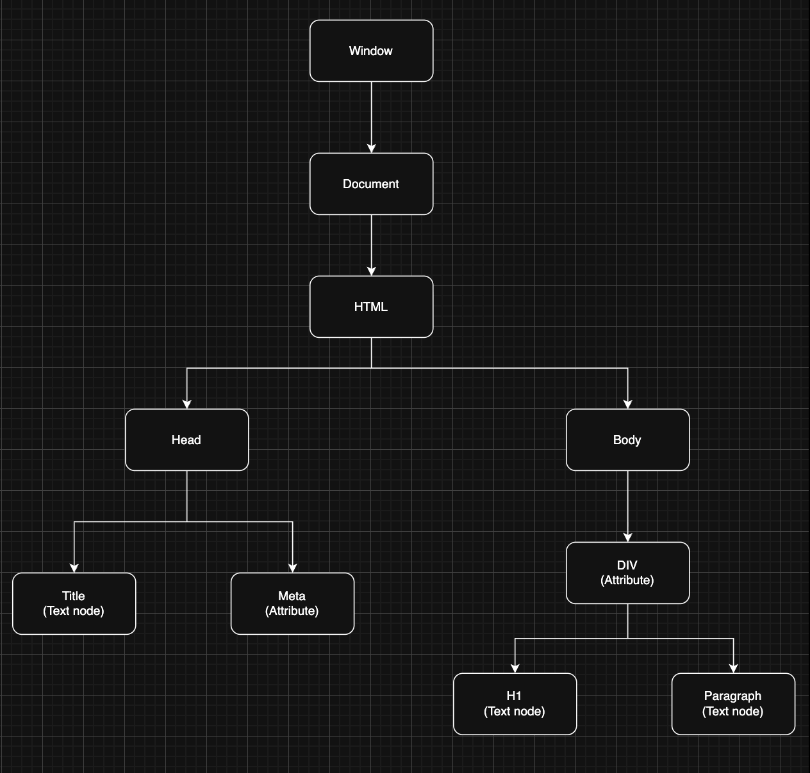

## Document Object Model (DOM) in JavaScript

The Document Object Model (DOM) is a programming interface for web documents. It represents the structure of a webpage as a tree of objects, allowing JavaScript to interact with and manipulate HTML and CSS dynamically.

### Key Concepts

- **DOM Tree:** The HTML document is represented as a tree of nodes (elements, attributes, text).
- **Accessing Elements:** JavaScript can select, modify, add, or remove elements from the DOM.



### Common DOM Methods

- `document.getElementById(id)`: Selects an element by its ID.
- `document.getElementsByClassName(className)`: Selects elements by class name.
- `document.getElementsByTagName(tagName)`: Selects elements by tag name.
- `document.querySelector(selector)`: Selects the first element matching a CSS selector.
- `document.querySelectorAll(selector)`: Selects all elements matching a CSS selector.

### Manipulating Elements

- **Change Content:**
	```js
	document.getElementById('demo').textContent = 'Hello, DOM!';
	```
- **Change Styles:**
	```js
	document.getElementById('demo').style.color = 'blue';
	```
- **Create/Remove Elements:**
	```js
	const newDiv = document.createElement('div');
	document.body.appendChild(newDiv);
	document.body.removeChild(newDiv);
	```

### Event Handling

JavaScript can respond to user actions (clicks, input, etc.) using event listeners:

```js
document.getElementById('btn').addEventListener('click', function() {
	alert('Button clicked!');
});
```

---
Mastering DOM manipulation is essential for creating interactive and dynamic web pages.
