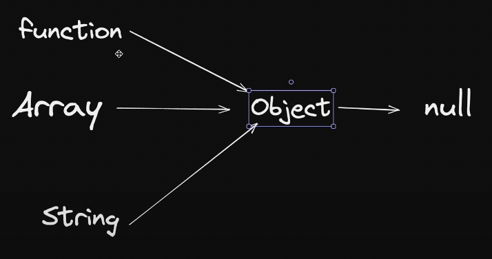

# Classes and Object-Oriented Programming in JavaScript

JavaScript is a prototype-based language that supports object-oriented programming through prototypes rather than traditional classes. ES6 introduced class syntax as syntactic sugar over JavaScript's existing prototype-based inheritance.

## Key Concepts

### Objects
Objects are collections of properties (data) and methods (functions). They can be created using object literals, constructor functions, or classes.

```js
const user = {
    username: 'Sudhanshu',
    loginCount: 5,
    signedIn: true,
    getUserDetails: function() {
        return `${this.username} has logged in ${this.loginCount} times`;
    }
}
```

### Constructor Functions
Constructor functions create new object instances with shared properties and methods:

```js
function Menu(item, price) {
    this.item = item;
    this.price = price;
}

Menu.prototype.display = function() {
    console.log(`Item: ${this.item}, Price: $${this.price}`);
}

const burger = new Menu('Burger', 5);
```

### Prototypes
JavaScript uses prototypal inheritance where objects inherit properties and methods from their prototype chain:

```js
const Teacher = { makeVideo: true }
const TA = { 
    isAvailable: false,
    __proto__: Teacher  // Inherits from Teacher
}
```



## The Four Pillars of OOP

1. **Abstraction:** Hiding complex implementation details and showing only essential features
2. **Encapsulation:** Bundling data and methods together, controlling access to object internals
3. **Inheritance:** Creating new objects based on existing ones, sharing properties and methods
4. **Polymorphism:** Objects of different types responding to the same interface

## Key Components

### 1. Constructor Functions
Always provide a new instance without affecting other objects:
```js
function User(name) {
    this.name = name;
}
```

### 2. Prototypes
Enable inheritance and method sharing across instances:
```js
User.prototype.greet = function() {
    console.log(`Hello, ${this.name}!`);
}
```

### 3. Classes (ES6+)
Syntactic sugar over prototype-based inheritance:
```js
class User {
    constructor(name) {
        this.name = name;
    }
    greet() {
        console.log(`Hello, ${this.name}!`);
    }
}
```

### 4. Instances and Keywords

#### The `new` Keyword
- Creates a new empty object
- Links it to the constructor's prototype
- Binds `this` to the new object
- Returns the new object (unless constructor returns an object)

#### The `this` Keyword
Refers to the current object context, determined by how a function is called.

## Prototype Chain Examples

### Setting Prototypes
```js
// Using __proto__ (not recommended in production)
user.__proto__ = TA;

// Using Object.setPrototypeOf (preferred)
Object.setPrototypeOf(user2, Teacher);
```

### Adding to Object.prototype
```js
Object.prototype.greet = function() {
    console.log("Hello from any object!");
}
// Now ALL objects have the greet method
```

## Function Context and Call Methods

JavaScript provides methods to control the context (`this`) of function execution:

### call() Method
The `call()` method allows you to call a function with a specific `this` context:

```js
function setUsername(username) {
    this.username = username;
}

function createUser(username, email, password) {
    this.email = email;
    this.password = password;
    setUsername.call(this, username);  // Call setUsername with current context
}

const user1 = new createUser('Sudhanshu', 'sudhanshu@example.com', 'password123');
console.log(user1); // { email: '...', password: '...', username: 'Sudhanshu' }
```

### Other Context Methods
- **apply()**: Similar to `call()`, but accepts arguments as an array
- **bind()**: Returns a new function with a permanently bound `this` context

## Modern JavaScript Classes

ES6 classes provide a cleaner syntax but work the same way underneath:

```js
class Animal {
    constructor(name) {
        this.name = name;
    }
    
    speak() {
        console.log(`${this.name} makes a sound`);
    }
}

class Dog extends Animal {
    speak() {
        console.log(`${this.name} barks`);
    }
}
```

---

JavaScript's flexible prototype system allows for powerful object-oriented programming patterns while maintaining the language's dynamic nature.