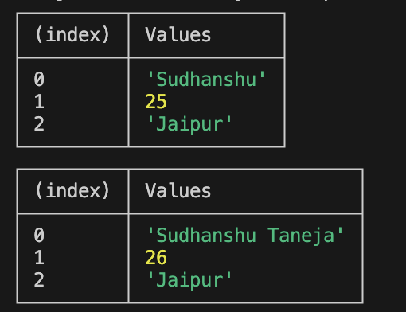

# Variable
We've 3 different types of variables in JS - 
1. Var - The variable can be re-declared and updated. A global scope variable. It shouldn't be used anywhere.
2. Let - The variable can't be re-declared but can be updated. A block scope variable.
3. Const - the variable can't be re-declared or updated. A block scope variable. It is compulsory to assign a value to it.

Once we comment out the code which tries to update a const variable, it'll result in a successful output.

# Datatypes
Various datatypes within javascript includes - 
1. number => 2 to power 53
2. bigint => Big integer values
3. string => " "
4. boolean => true/false
5. null => There's some value inside the variable but it's empty. It's an object.
6. undefined => There's no value inside the variable.
7. symbol => Find uniqueness of a component.

# Conversion of datatypes

1. toNumber - In order to convert a variable to number, we just use "Number" to convert. In case the string entered is not pure number, it returns NaN, i.e., Not a Number.

In case the value passed is null in the variable, it'll give the output as 0.

2. toBoolean - In order to convert a variable to boolean, we can just use "Boolean". In numbers, 1 means true while 0 means false. In string, an mpty string means false, while otherwise it means true.

