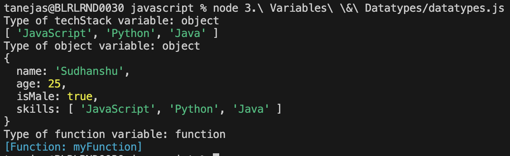
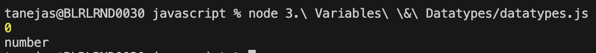
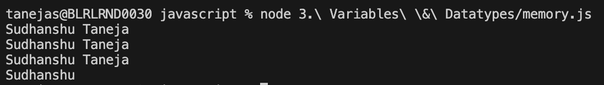
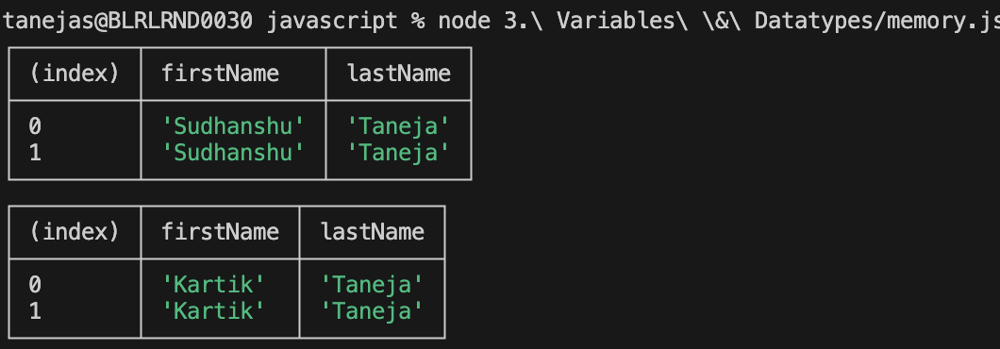
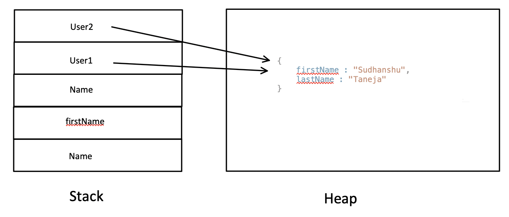

## Variables and Data Types in JavaScript

Variables and data types are the foundation of any JavaScript program. Understanding how to declare variables and work with different data types is essential for writing robust code.

### Variable Declarations

- **var**: Can be re-declared and updated. Function-scoped. Not recommended for modern code.
- **let**: Can be updated but not re-declared in the same scope. Block-scoped.
- **const**: Cannot be updated or re-declared. Block-scoped. Must be initialized at declaration.

```js
let age = 25;
const name = "Alice";
var city = "New York";
```

> Attempting to update a `const` variable will result in an error:


> Once the error is fixed, the code runs successfully:


### Data Types

#### Primitive Types (Call by Value)
- **number**: Numeric values (e.g., 42)
- **bigint**: Large integers
- **string**: Text values (e.g., "hello")
- **boolean**: `true` or `false`
- **null**: Represents intentional absence of value (typeof is 'object')
- **undefined**: Variable declared but not assigned a value
- **symbol**: Unique identifiers


#### Non-Primitive Types (Reference Types)
- **Array**
- **Object**
- **Function**



### Type Conversion

- Use `Number()` to convert a value to a number. If conversion fails, returns `NaN`.
- Converting `null` to a number returns `0`.

```js
let str = "123";
let num = Number(str); // 123
let invalid = Number("abc"); // NaN
let n = Number(null); // 0
```



.png)

2. toBoolean - In order to convert a variable to boolean, we can just use "Boolean". In numbers, 1 means true while 0 means false. In string, an mpty string means false, while otherwise it means true.


# Memory types

1. Stack - 
    a. Used for primitive data-types.
    b. A copy of the variable will be provided whenever used and thus, it won't change if the copy is changed.

    

2. Heap - 
    a. Used for non-primitive data-types.
    b. A reference of the variable will be provided whenever used and thus, the data of the variable will change wherever used.

    

