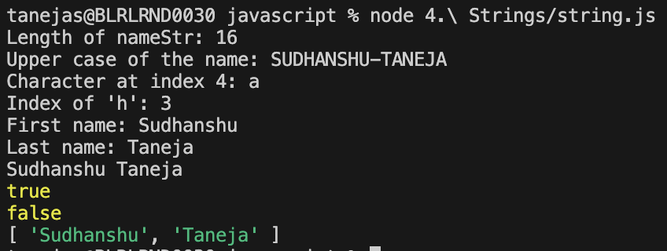

## Strings in JavaScript

Strings are sequences of characters used to represent text. They can be created using single quotes, double quotes, or backticks (for template literals).

### Declaring Strings

```js
let str1 = "Hello";
let str2 = 'World';
let str3 = `Hello, ${str2}!`;
```


### String Interpolation

Template literals (backticks) allow embedding variables and expressions directly in strings:

```js
let name = "Alice";
let greeting = `Hello, ${name}!`;
```


### Common String Methods

- **length**: Returns the length of the string.
- **toUpperCase()**: Converts to uppercase.
- **charAt(index)**: Returns character at a given index.
- **indexOf(substring)**: Finds the position of a substring.
- **substring(start, end)**: Extracts part of the string.
- **slice(start, end)**: Similar to substring, but supports negative indices.
- **replace(search, value)**: Replaces part of the string.
- **includes(substring)**: Checks if substring exists.
- **split(separator)**: Splits string into an array.

```js
let text = "JavaScript";
console.log(text.length); // 10
console.log(text.toUpperCase()); // "JAVASCRIPT"
console.log(text.charAt(4)); // "S"
```


