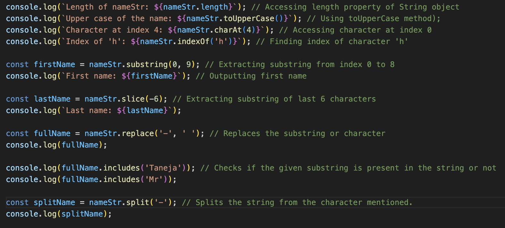
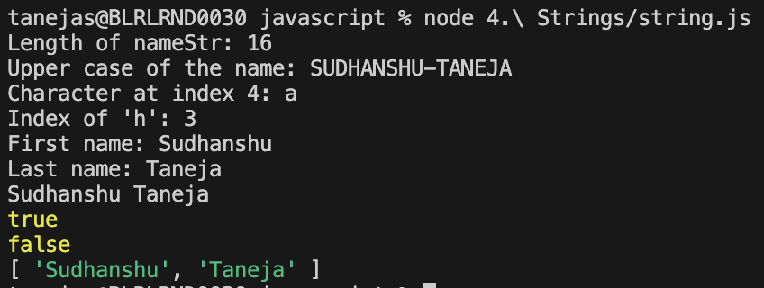

# Strings

String can be declared not only by using inverted commas (" ") but also the String object which is called in the backend.

# String interpolation

In order to add variables dynamically into a string, you need to create placeholders.

# Prototypes of string

There are inbuilt functions/methods provided as prototypes that can be used directly - 

1. Length - Gives the length of the string.
2. toUpperCase - Gives the entire string in uppercase. Don't change the string value as the variable's copy is being used.
3. charAt - Returns the character at a specific position.
4. indexOf - Returns the position of a specific character.
5. substring - Divides the string as per index numbers given.
6. slice - It is very similar to substring but in this case you can give negative values too as input in which case, it'll start backwards.
7. replace - Replace the substring or character with the desired value.
8. includes - Checks if the given substring is present in the string or not.
9. split - Splits the string based on the character given.

