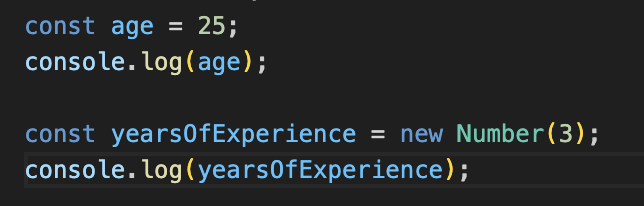
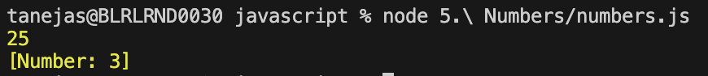
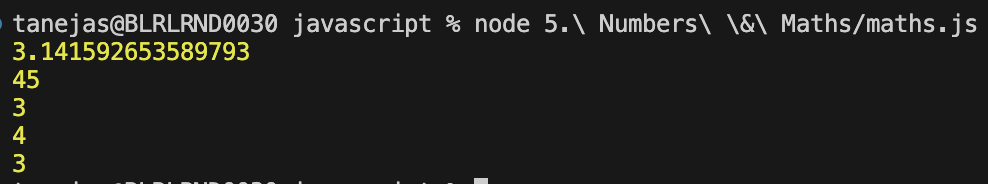

## Numbers and Math in JavaScript

JavaScript provides powerful features for working with numbers and performing mathematical operations.

### Declaring Numbers

Numbers can be declared directly or by using the `Number()` function:

```js
let a = 42;
let b = Number("3.14");
```




### Common Number Methods

- **toFixed(digits)**: Rounds the number to a fixed number of decimal places and returns a string.
- **toPrecision(length)**: Formats a number to a specified length.
- **toLocaleString()**: Converts the number to a string using local language format.
- **MAX_VALUE, MIN_VALUE, MAX_SAFE_INTEGER**: Properties for numeric limits in JavaScript.

```js
let num = 123.456;
console.log(num.toFixed(2)); // "123.46"
```


### Math Object

The built-in `Math` object provides methods for mathematical tasks:

- **Math.abs(x)**: Absolute value
- **Math.round(x)**: Rounds to nearest integer
- **Math.ceil(x)**: Rounds up
- **Math.floor(x)**: Rounds down
- **Math.min(...args)**: Minimum value
- **Math.max(...args)**: Maximum value
- **Math.random()**: Random number between 0 and 1

```js
console.log(Math.round(2.7)); // 3
console.log(Math.random()); // e.g., 0.12345
```


