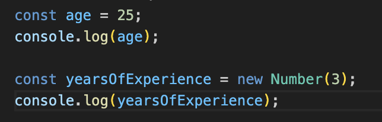
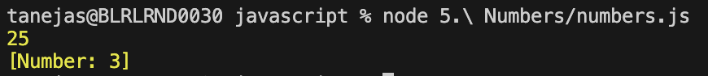
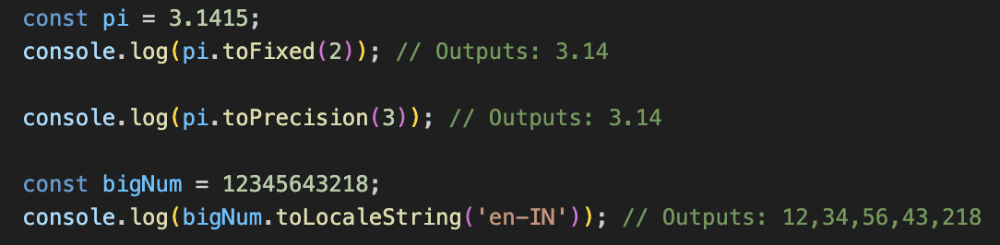
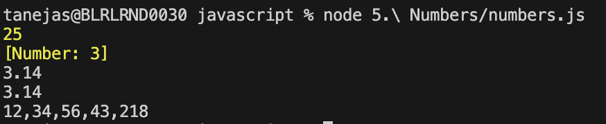

# Numbers

Other than just declaring the number, you can also explicitly define a number by using "Number" function. It'll provide a lot of additional functions or methods.

1. toFixed - Converts the number to a string and rounds the string to a specified number of decimals.
2. toPrecision -  Formats a number to a specified length where the priority is given to the numbers before decimal.
3. toLocaleString - Converts the number to string using local language format.
4. MAX_VALUE - Returns the maximum value that can be saved in a number in javascript. 
5. MIN_VALUE - Returns the minimum value that can be saved in a number in javascript. 
6. MAX_SAFE_INTEGER - Returns the maximum integer value that can be saved.

# Maths

It's an in-built object in javascript that allows you to perform mathematical tasks on numbers.

1. abs - Returns the absolute value of the number.
2. round - Rounds off the number.
3. ceil - Rounds off the number towards the top value.
4. floor - Rounds off the number towards the lower value.
5. min - Returns the minimum value in an array.
6. max - Returns the maximum value in an array.
7. random - Returns a random value in between 0 & 1, both included.
