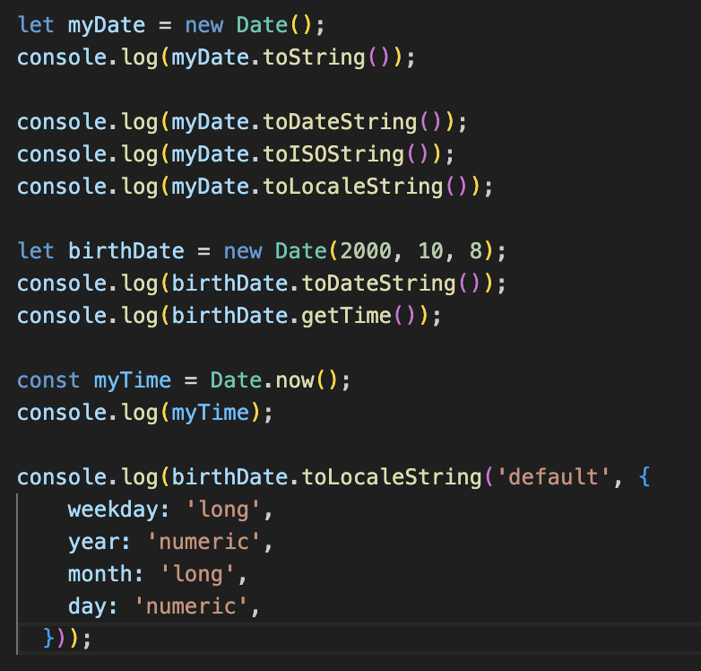
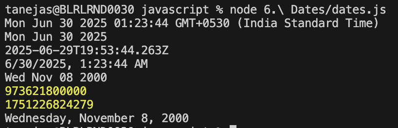

## Dates in JavaScript

The `Date` object in JavaScript represents a single moment in time, measured in milliseconds since January 1, 1970 (the Unix epoch).

### Key Concepts

- **Creating Dates:**
	- `new Date()`: Current date and time
	- `new Date("2025-08-29")`: Specific date
- **Getting and Setting Components:**
	- `getFullYear()`, `getMonth()`, `getDate()`, etc.
	- `setFullYear()`, `setMonth()`, etc.
- **Formatting Dates:**
	- Use methods like `toLocaleDateString()` for readable output
- **Temporal API:**
	- JavaScript is introducing the Temporal API for more robust date/time handling in the future.

### Examples

```js
let now = new Date();
console.log(now.toLocaleString());

let birthday = new Date("2000-01-01");
console.log(birthday.getFullYear()); // 2000
```


