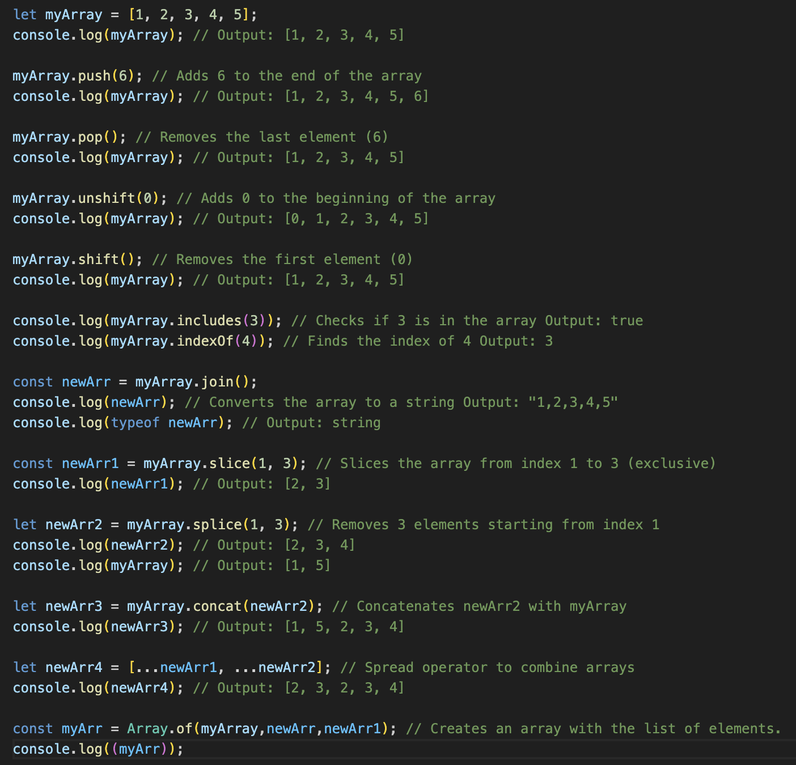
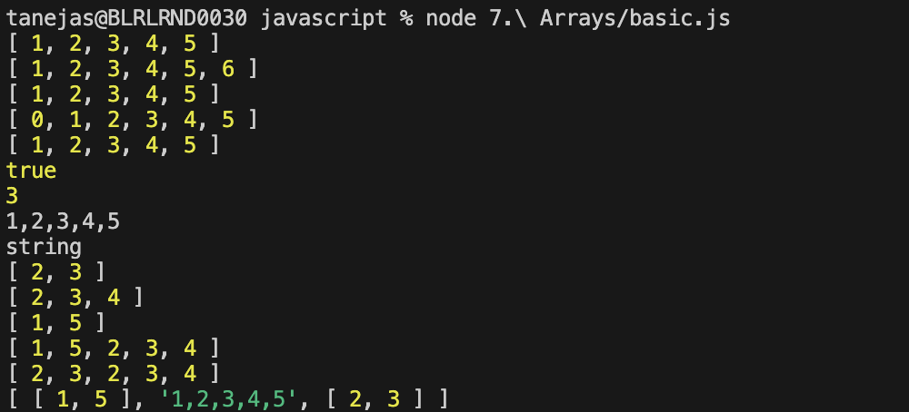

# Arrays

In javascript, array aren't primitives but are instead Array objects with following characteristics - 

1. They are resizable and can contain a mix of different datatypes.
2. They are not associated arrays and thus, array elements can't be accessed using arbitrary strings.
3. They are zero-indexed. 
4. The copy operations create shallow copies, i.e., the copy of the array share the same reference.

Various methods provided for arrays are - 

1. push - It adds the value at the end in the array.
2. pop - It removes the last value from the array.
3. unshift - It adds the value at the start in the array.
4. shift - It removes the first value from the array.
5. includes - It checks if the value is present in an array or not.
6. index - It gives the index of the value you're looking for. In case the value is not present, it returns "-1".
7. join - It binds the array and returns it in type of string.
8. concat - It adds an array into another array.
9. spread - It breaks the array into individual items and merge all the items.
10. flat - It returns a new array with all sub-array elements concatenated into it recursively up to the specified depth.
11. of - Returns a new array from the set of elements.

