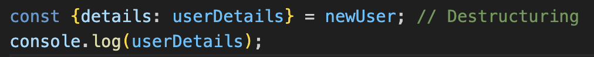

# Objects

Objects can be declared in 2 ways - 

1. Via literals - There can be multiple instances of an object if you create via literals. It is declared in a key value pair.

2. Via constructors - If you create an object via constructor, then it's created as singleton, i.e., there is only 1 type of this object.

# Destructring objects

We can de-structure the object and save it's values into different variables.

