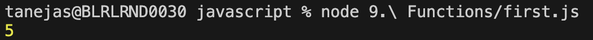

# Functions

Functions is a block of code desined to perfrom a particular task. Different values that are passed are - 

Parameters - The values that are passed in the function definition.
Arguments - The values that are pass while calling the function.

