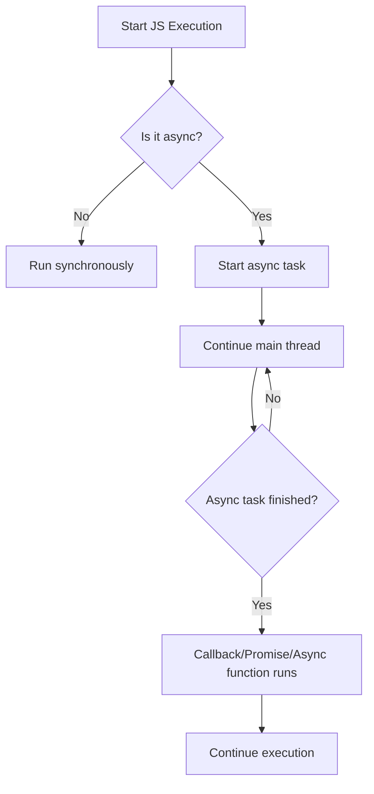

## Asynchronous JavaScript

Asynchronous programming allows JavaScript to perform long-running tasks (like fetching data from a server) without blocking the main thread. This enables smooth user experiences and efficient resource usage.

### Key Concepts

- **Synchronous:** Code runs line by line, each step waits for the previous one to finish.
- **Asynchronous:** Code can start tasks and continue running without waiting for them to finish (e.g., setTimeout, AJAX, Promises).

### Common Async Patterns

- **Callbacks:** Functions passed as arguments to be executed later.
- **Promises:** Objects representing the eventual completion or failure of an async operation.
- **Async/Await:** Syntax for writing async code that looks synchronous.

### Flow Chart: Async Operation in JavaScript



### Example

```js
console.log('Start');

setTimeout(() => {
	console.log('Async task');
}, 1000);

console.log('End');
```

**Output:**
```
Start
End
Async task
```

### Summary

- Async code lets JavaScript handle multiple tasks efficiently.
- Use callbacks, promises, or async/await for async operations.
- The event loop manages async tasks, ensuring non-blocking execution.
# Javascript
1. JS is a synchronous single-threaded language. It means JS can execute one command at a time and in a specific order.
2. JS is a loosely typed language or weekly typed language because it is very flexible in variable defining.
3. JS can behave both an interpreted & compiled language depending on the JS engine.
4. If you mention, "use strict" on the top of your javascript file, it enables the strict mode which treats all JS code as newer version.